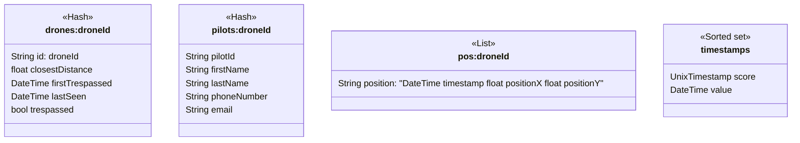

# Backend for [Reaktor assignment](https://assignments.reaktor.com/birdnest)

Live version: [https://monadikuikka.fly.dev](https://monadikuikka.fly.dev)

The backend polls the [given API](https://assignments.reaktor.com/birdnest/drones) every 2000 milliseconds (configurable) to get a snapshot of data, which it then processes and stores locally in [Redis](https://redis.io).

Position data is saved for each drone. Pilot data is only saved if a drone trespassed.

The drone / pilot / position data expires in exactly 10 minutes.

Timestamps from the snapshot are saved to ensure that we don't get the same data twice. Old timestamps are regularly removed every 30 minutes (configurable).

For the live version of the assignment, Redis is configured so that it never saves the DB to disk, so data is not persistent.

# Installation
1) Install `node` and `redis`
2) `git clone https://github.com/luupanu/monadikuikka_backend.git`
3) `npm install`
4) Create an `.env` file in the root directory with the following keys:
```
BIRDNEST_API="https://assignments.reaktor.com/birdnest/drones"
DRONE_REGISTRY_API="https://assignments.reaktor.com/birdnest/pilots"
DB_TIMESTAMPS_REMOVE_INTERVAL_SECONDS=1800
POLL_INTERVAL_MS=2000
PORT=3001
REDIS_FUNCTIONS_FILE="redis_functions.lua"
FRONTEND_URL="http://localhost:3000"
```
5) `npm start`

# Run tests

1) `npm test`

# Package together with frontend

Make sure you've installed `monadikuikka_backend` first.

First install `monadikuikka_frontend` to the same parent directory as `monadikuikka_backend`:

1) Navigate to `monadikuikka_backend` directory using terminal.
2) `cd ../ && git clone https://github.com/luupanu/monadikuikka_frontend.git`
3) `cd monadikuikka_frontend && npm install`
4) `cd ../monadikuikka_backend`

Then run:

1) `npm run build:frontend`
2) `npm run start`

and you should be good to go.

# Deploy to [Fly.IO](https://fly.io)

1) Install [flyctl](https://fly.io/docs/hands-on/install-flyctl) and navigate to `monadikuikka_backend`.
2) Create an account with `fly auth signup` or login using `fly auth login`
3) Run `fly launch` and make sure to use the existing Dockerfile. Don't deploy yet.
4) [Edit `fly.toml`](https://fly.io/docs/reference/configuration/#the-env-variables-section) to include all the keys from our `.env` file.
5) Be sure to edit the key `FRONTEND_URL` to be the actual domain you are using. This key is used to allow Cross-origin resource sharing (CORS) between the backend and the frontend.
6) `npm run deploy`.

# Class diagram


Note that every value in Redis is always stored as a String.
